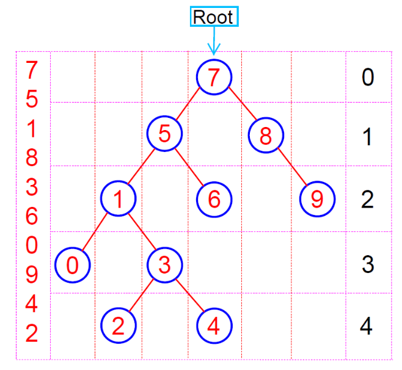

# Binary Search Tree
https://app.patika.dev/alibaris

# Proje-3
## Soru 1
**[7, 5, 1, 8, 3, 6, 0, 9, 4, 2]** dizisinin Binary-Search-Tree aşamalarını yazınız.

**Örnek**: root x'dir. root'un sağından y bulunur. Solunda z bulunur vb.

**Çözüm**
**[7, 5, 1, 8, 3, 6, 0, 9, 4, 2]**
- root ''7'' olarak belirlenir ve sırasıyla diğer indexlerden küçük olanlar sola, büyük olanlar sağa olacak şekilde yazılır.

www.patika.dev